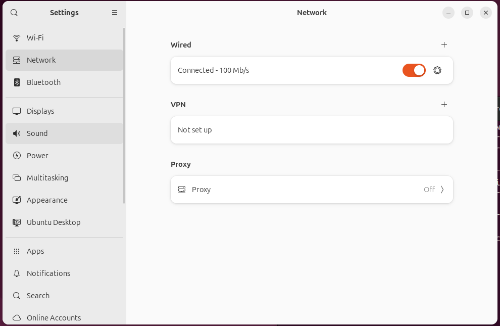
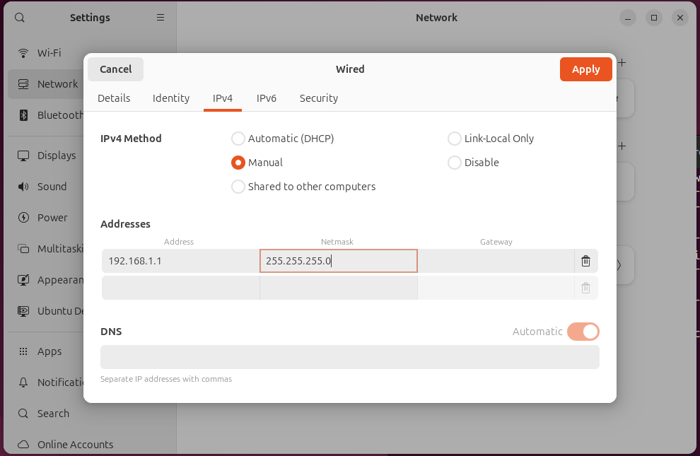
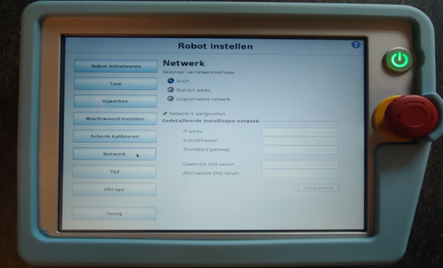
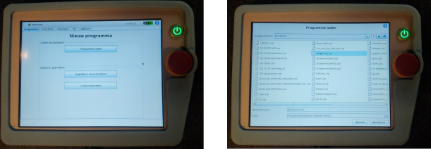
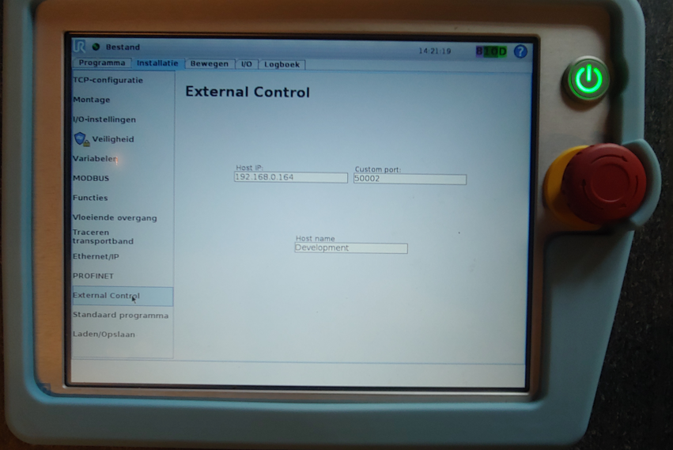
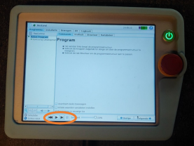

# Fysieke UR-robot

In dit hoofdtuk wordt beschreven hoe je een verbinding kunt opzetten tussen de development-computer en de fysieke robot.

## Netwerkverbinding opzetten
::::::{card} 

:::::{tab-set}

::::{tab-item} Doormidddel van `router`

Je kunt een verbinding opzetten tussen de robot en development-computer door middel van een router. De router zorgt voor een stabiele verbinding tussen de robot en development-computer, en voorkomt interferentie met andere apparaten in het netwerk. Tevens kun je met een router ook andere apparaten in het netwerk opnemen zoals b.v. camera's of de teachbot

## Configuratie router
De router dient geconfigureerd te worden zodat het subnet `192.168.1.0` wordt. 
>Het instellen van de router valt buiten deze beschrijving en is router-type afhankelijk.

:::{tip}
Gebruik alleen de `LAN` poorten van de router, niet de `WAN` poort.
:::


::::

::::{tab-item} Rechtstreekse met een `cat5-kabel`
Je kunt ook een rechtstreekse verbinding opzetten tussen de robot en development-computer door middel van een `cat5-kabel`. Kies deze optie als je geen andere apparaten in het netwerk wilt opnemen.

je kunt in dit geval het ip-adres van de robot en development-computer handmatig instellen. Zorg ervoor dat je deveopment-computer een ip-adres krijgt in het subnet `192.168.1.x`.

Open op de development-computer de netwerkinstellingen:


Kies onder `wired` het tandwiel icoon en vervolgens `IPv4` tabblad. Kies hier voor `Manual` en vul de volgende gegevens in:
* IP-adres: 192.168.1.1 (je kunt ook een ander ip-adres kiezen, zolang deze maar in het subnet `192.168.1.x` ligt)
* Netmask: 255.255.255.0
* Gateway: 192.168.1.1



Sluit de instellingen.

:::{tip}
Soms komt de netwerk verbinding niet tot stand, in dat geval kan het helpen om de netwerkverbindingen uit en weer aan te zetten. Je kunt ook proberen om de robot en development-computer te rebooten.
:::

::::

:::::

::::::

### Netwerkconfiguratie development-computer testen
Open een terminal en voer het volgende commando uit:
```bash
ifconfig | grep broadcast
```

dit zal ongeveer dit resultaat opleveren:
```bash
    inet 192.168.1.1  netmask 255.255.255.0  broadcast 192.168.1.255
```


>Controleer of het ip-adres in het juiste subnet opgenomen is `192.168.1.x`

Noteer dit ip-adres, je zult het nodig hebben bij de configuratie van de UR-robot.

### Configuratie UR-robot
Verbind de UR-robot met het netwerk van de router met een `cat5-kabel` en voer de volgende handelingen uit op de teachpendant van de UR-robot

### Opvragen IP-adres van de UR-robot
Ga op de teachpendant van de UR-robot naar het Robot Instellen scherm en selecteer Netwerk.



:::{attention}
 Het IP-adres is niet aan te passen in DHCP-mode. Wijzig deze mode niet, lees alleen de waarde van het IP-adres uit en noteer deze.
Is het IP-adres 0.0.0.0 controleer dan de verbinding tussen de UR-robot en de router en reboot de UR-robot vervolgens.
:::

### Instellen development-computer IP-adres op UR-5 Robot

Open op de teach-pendent van de UR-robot het programma `RosControl.urp`.
    • Gebruik de `Programma Laden` Functie



Selecteer het tabblad `Installatie` en de functie `External Control`.

Vul op de volgende gegevens in:
* Host IP: 	Ip-adres van de development-computer
* Custom port: 	50002
* Host name:	Development



## Testen communicatie met uFactory Lite6 robot
Je kunt de communicatie met de robot testen met het volgende commando:
```bash
ping <ip-address-robot>
```

Het resultaat moet dan hier op lijken
```text
PING <ip-address-robot> (<ip-address-robot>) 56(84) bytes of data.
64 bytes from <ip-address-robot>: icmp_seq=1 ttl=64 time=0.030 ms
64 bytes from <ip-address-robot>: icmp_seq=2 ttl=64 time=0.041 ms
64 bytes from <ip-address-robot>: icmp_seq=3 ttl=64 time=0.040 ms
^C
--- <ip-address-robot> ping statistics ---
3 packets transmitted, 3 received, 0% packet loss, time 2069ms

```

## Starten van de robot

```
ros2 launch my_ur_bringup real_robot.launch.py robot_ip:=<robot_ip>
```
Op de teach-pendent van de UR-robot:
* Ga naar programma "Programma Laden"
* Selecteer het programma `RosControl.urp`, zie hierboven.
* Start het programma door op play te toetsen




Volg de output in de terminal en evalueer of er een goede connectie met de robot tot stand is gekomen.

:::{tip}
Je kunt ook in het bestand /<workspace>/src/my_ur_ROS2/my_ur_bringup/launch/real_robot.launch.py het ip-adres wijzigen op regel 45.Daarna hoef je de robot_ip argument niet meer aan bovenstaande commando toe te voegen.
:::

## Testen van de robot
Je kunt de robot nu laten bewegen door de `movegroup`-node te starten met:

```
ros2 launch my_ur_bringup movegroup.launch.py 
```
RVIZ zal nu worden opgestart en een virtuele weergave van de robot-opstelling wordt nu zichtbaar. 
De stand van de robot in de virtuele wereld moet overeen komen met de stand van de UR-robot.

Je kunt de robot nu laten bewegen door het selecteren van een pose met de knop `Goal State` een positie kiezen en de weg naar de positie volgen met de `Plan` knop. Vervolgens kun je `Plan & Execute` of `Execute` bedienen waarna de robot zal bewegen naar de gekozen pose.
:::{danger}
Zorg ervoor dat de robot vrijelijk kan bewegen en geen obstakels tegen komt.
:::


## Extra informatie
[Officiele documentatie UR CB3 Robot Setup](https://docs.universal-robots.com/Universal_Robots_ROS2_Documentation/doc/ur_client_library/doc/setup/robot_setup.html)

[Universal Robots ROS 2 driver documentation](https://docs.universal-robots.com/Universal_Robots_ROS2_Documentation/index.html)
